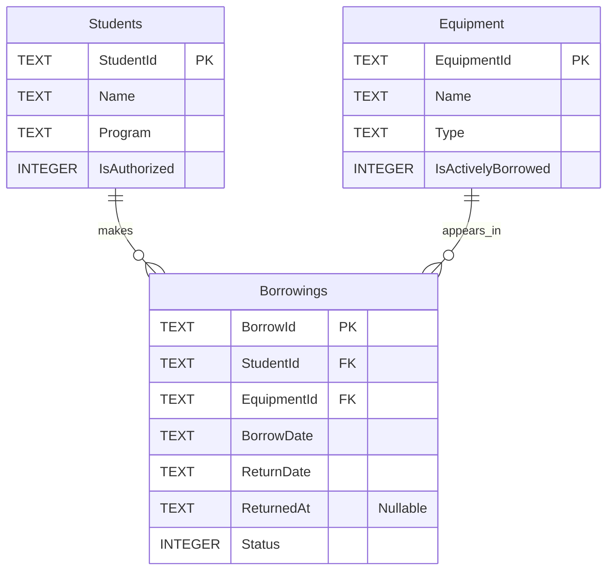

# Database Diagram

This diagram describes the planned SQLite schema for the Campus
Equipment Borrowing System.

## How to Read the Diagram

- PK means primary key: it uniquely identifies a record.
- FK means foreign key: it references a record in another table.
- One student can have zero or many borrowing records.
- One equipment item can have zero or many borrowing records over time.
- Each borrowing must reference exactly one student and one equipment item.

## Important Rules

- ReturnDate is the expected return date.
- ReturnedAt is null while a borrowing is active.
- Status is 0 for Active and 1 for Returned.
- IsAuthorized and IsActivelyBorrowed use 0 for false and 1 for true.
- Only one active borrowing is allowed per equipment item.
- Deleting students or equipment referenced by borrowing history is restricted.

The equipment relationship allows multiple historical borrowing records.
A separate unique partial index will prevent multiple active borrowings
for the same equipment item.

The full constraints and indexing decisions are documented in
[database-design.md](database-design.md).