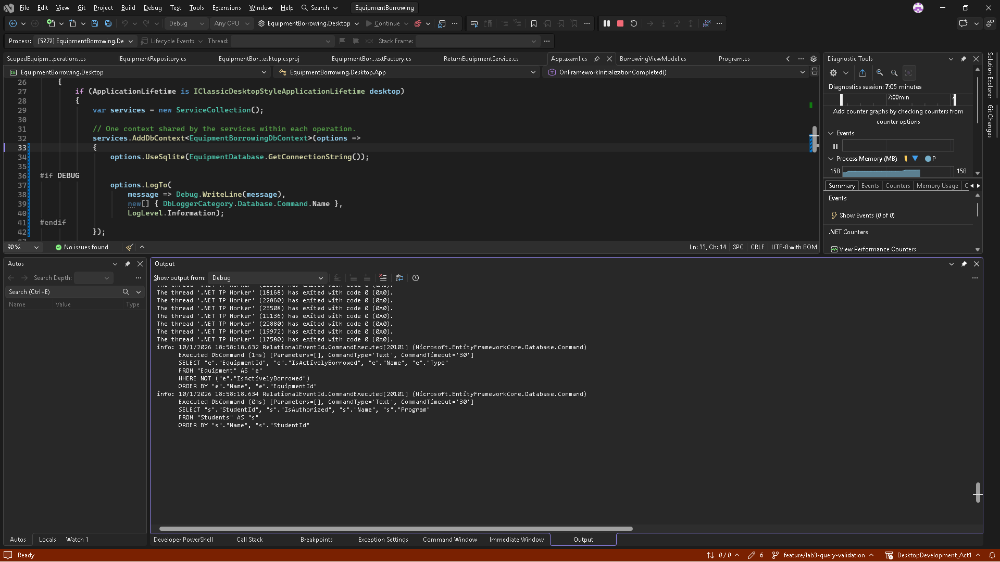
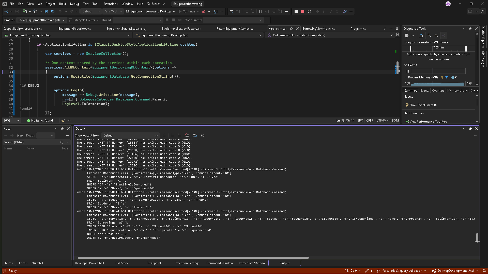
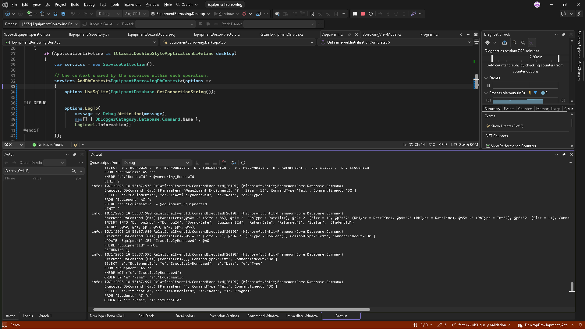
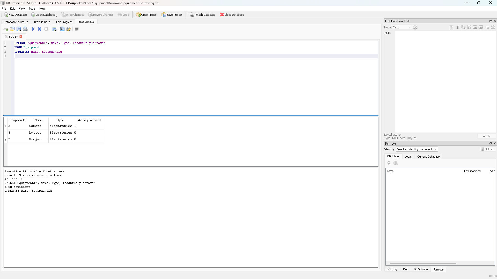
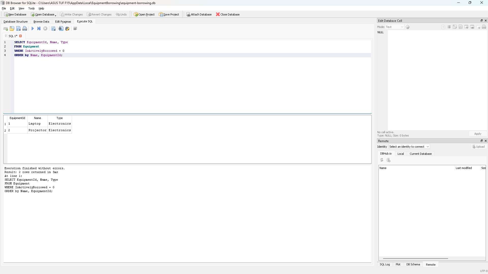
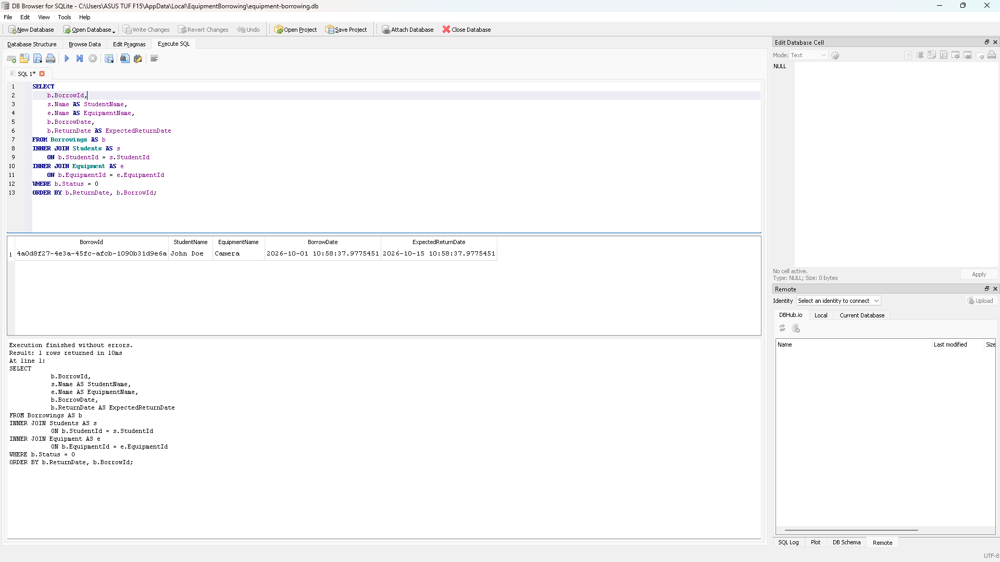
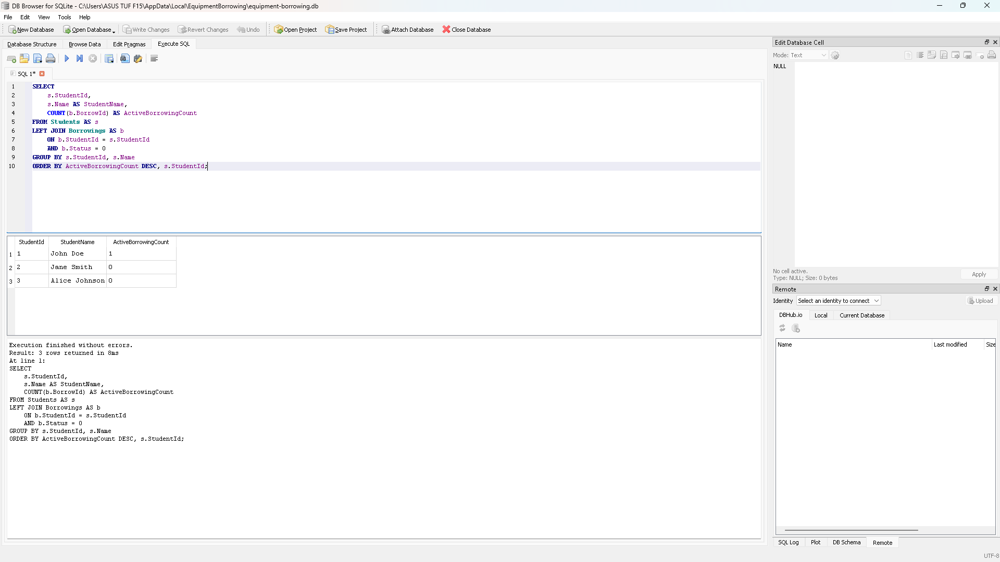
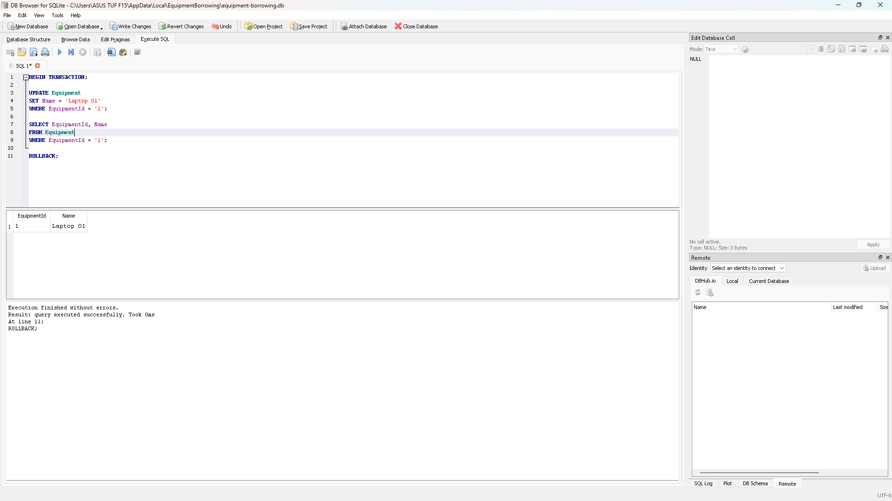
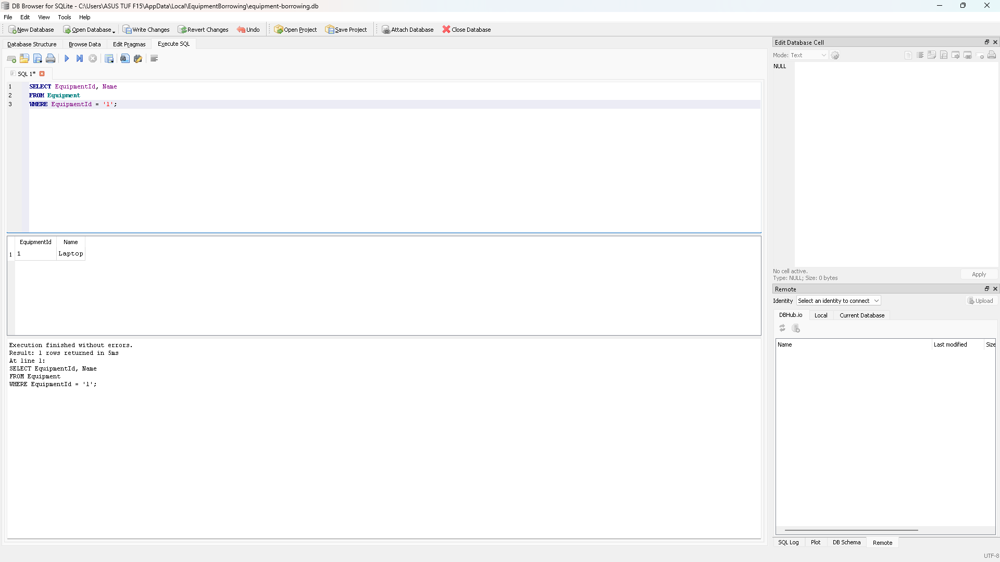

# LINQ Queries and Generated SQL

The desktop application executes these queries through EF Core's
SQLite provider. SQL was captured from Visual Studio's Debug Output
using EF Core command logging.

## 1. Available Equipment

Purpose: display equipment that is not currently borrowed.

```csharp
return await _context.Equipment
    .AsNoTracking()
    .Where(equipment => !equipment.IsActivelyBorrowed)
    .OrderBy(equipment => equipment.Name)
    .ThenBy(equipment => equipment.EquipmentId)
    .ToListAsync(cancellationToken);
```

Captured SQL:

```sql
SELECT "e"."EquipmentId", "e"."IsActivelyBorrowed", "e"."Name", "e"."Type"
FROM "Equipment" AS "e"
WHERE NOT ("e"."IsActivelyBorrowed")
ORDER BY "e"."Name", "e"."EquipmentId"
```

The Where expression becomes a SQL WHERE condition. OrderBy and
ThenBy become ORDER BY. Filtering and sorting happen in SQLite
before the results are loaded into a list.

Manual verification: the Laptop disappeared from Available Equipment
after borrowing and reappeared after returning.

## 2. Active Borrowings with Student and Equipment

Purpose: display active loans with the student's name, equipment name,
and due date.

```csharp
return await _context.Borrowings
    .AsNoTracking()
    .Where(borrowing => borrowing.Status == BorrowingStatus.Active)
    .Include(borrowing => borrowing.Student)
    .Include(borrowing => borrowing.Equipment)
    .OrderBy(borrowing => borrowing.ReturnDate)
    .ThenBy(borrowing => borrowing.BorrowId)
    .ToListAsync(cancellationToken);
```

Captured SQL:

```sql
SELECT "b"."BorrowId", "b"."BorrowDate", "b"."EquipmentId",
       "b"."ReturnDate", "b"."ReturnedAt", "b"."Status", "b"."StudentId",
       "s"."StudentId", "s"."IsAuthorized", "s"."Name", "s"."Program",
       "e"."EquipmentId", "e"."IsActivelyBorrowed", "e"."Name", "e"."Type"
FROM "Borrowings" AS "b"
INNER JOIN "Students" AS "s" ON "b"."StudentId" = "s"."StudentId"
INNER JOIN "Equipment" AS "e" ON "b"."EquipmentId" = "e"."EquipmentId"
WHERE "b"."Status" = 0
ORDER BY "b"."ReturnDate", "b"."BorrowId"
```

BorrowingStatus.Active is stored as 0. The Include calls produce joins
that load the related student and equipment. Results are ordered by
ReturnDate, which represents the expected due date, then BorrowId.

Manual verification: John Doe's laptop loan appeared while active
and disappeared from Active Borrowings after returning.

## 3. Student List

Purpose: populate the student selector in a consistent order.

```csharp
return await _context.Students
    .AsNoTracking()
    .OrderBy(student => student.Name)
    .ThenBy(student => student.StudentId)
    .ToListAsync(cancellationToken);
```

This query loads students ordered by name, then student ID.
It includes both authorized and unauthorized students. The borrowing
service checks authorization before allowing a loan.

Manual verification: the selector displayed Alice Johnson, Jane Smith,
and John Doe in alphabetical order.

## Tracking and No-Tracking Queries

Display queries use AsNoTracking because their returned entities are
used for presentation rather than updates. This avoids adding those
entities to the context's change tracker.

Lookups used by borrowing and returning use tracking. Within each
operation, repositories and EfUnitOfWork share one DbContext.
Changes to tracked entities are persisted when the application service
calls SaveChangesAsync.

AsNoTracking affects EF Core's handling of returned entities; it does
not add a WHERE condition or another clause to the generated SQL.

## SQL Capture

App.axaml.cs configures LogTo for the Database.Command category inside
an #if DEBUG block. Commands appear in Visual Studio's Debug Output
when the corresponding screen loads.

The SQL above was captured from executed commands. Line wrapping was
adjusted for readability.

## Screenshots

### Available Equipment SQL


### Active Borrowings SQL


### Borrowing INSERT and Equipment UPDATE


## Handwritten SQL Verification

All five examples in database-queries.sql were executed successfully
using DB Browser for SQLite against the application's database.

### 1. All Equipment

Returned all three equipment items.



### 2. Available Equipment

Returned Laptop and Projector. Camera was excluded because it was borrowed.



### 3. Active Borrowings

Joined borrowings, students, and equipment, showing John Doe's active
Camera borrowing.



### 4. Active Borrowing Counts

Returned John Doe with one active borrowing, and Jane Smith and
Alice Johnson with zero. LEFT JOIN retained students with no active loans.



### 5. Update and Rollback

Temporarily changed Laptop to Laptop 01 inside a transaction.



After ROLLBACK, a separate SELECT confirmed the name was restored to Laptop.

