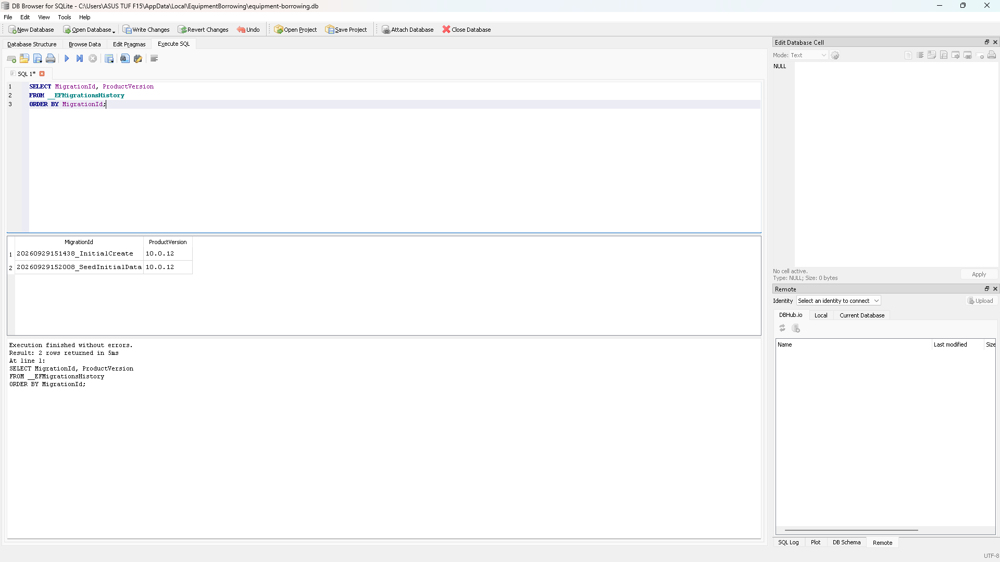
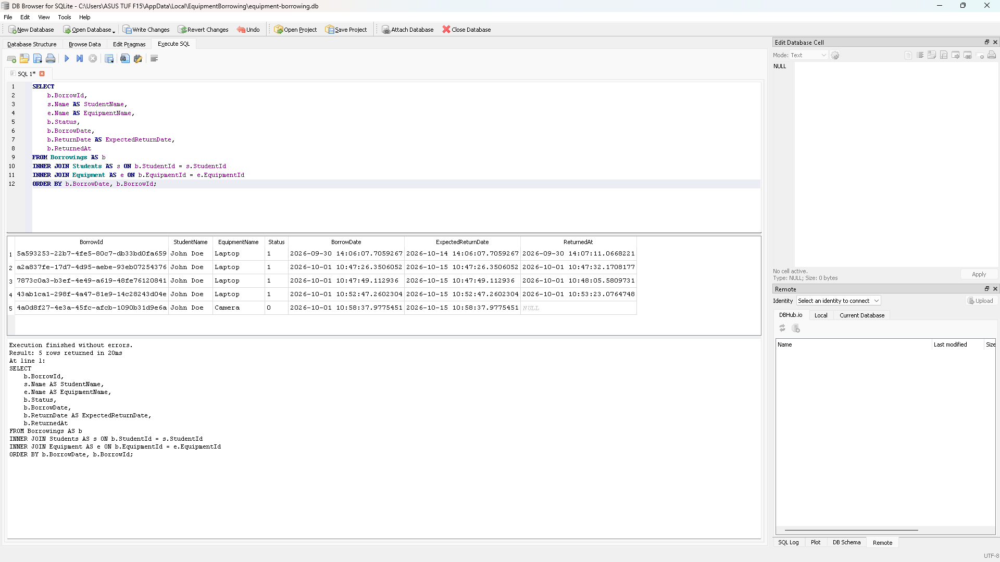
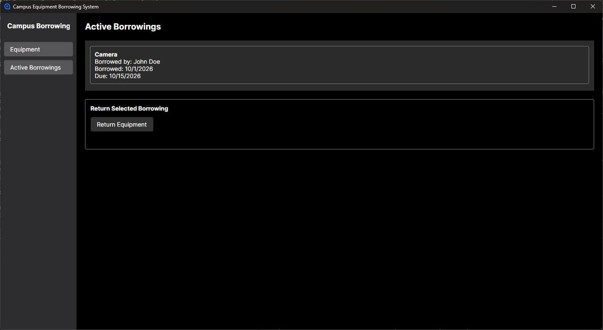
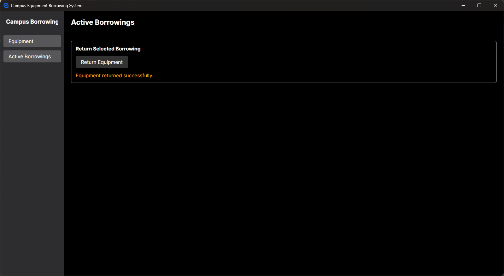
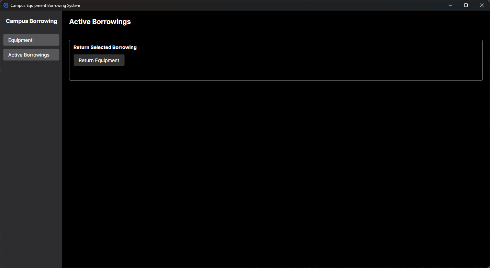
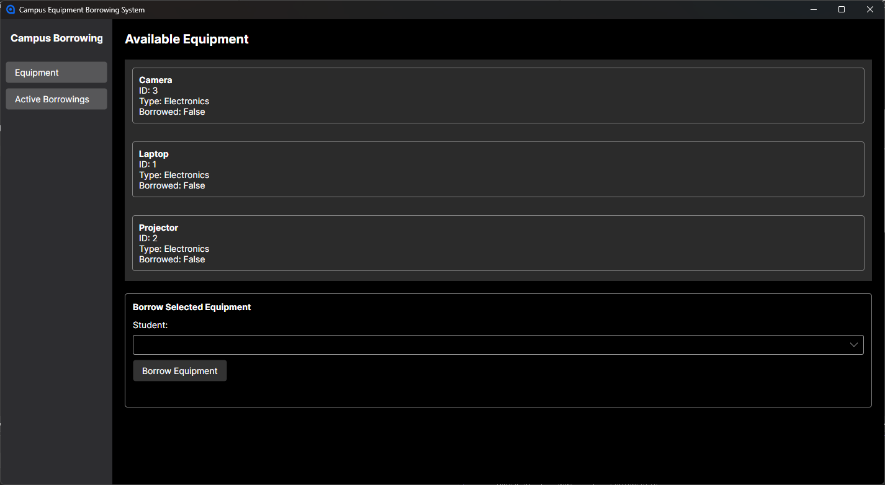
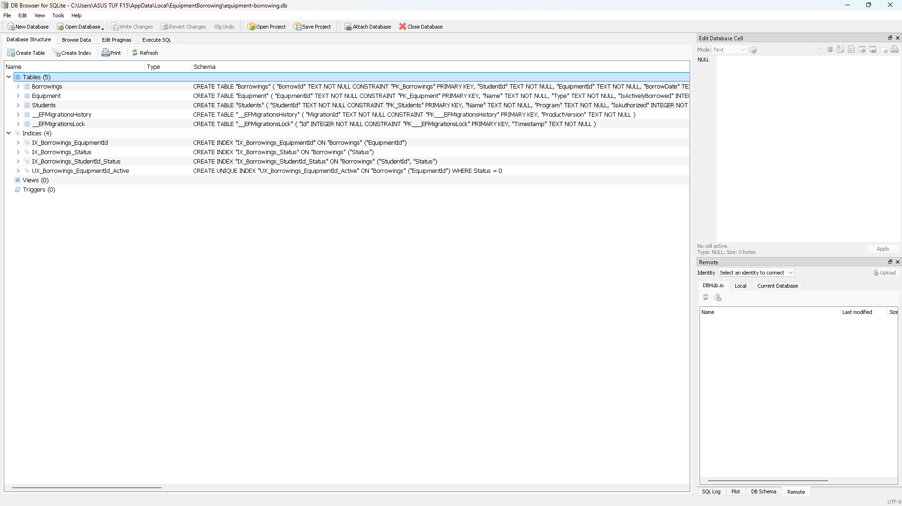
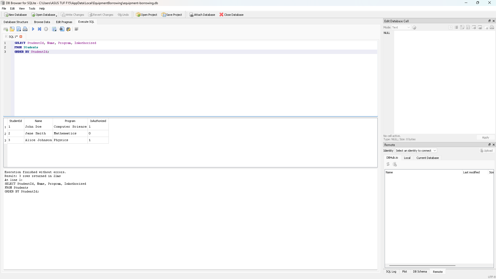
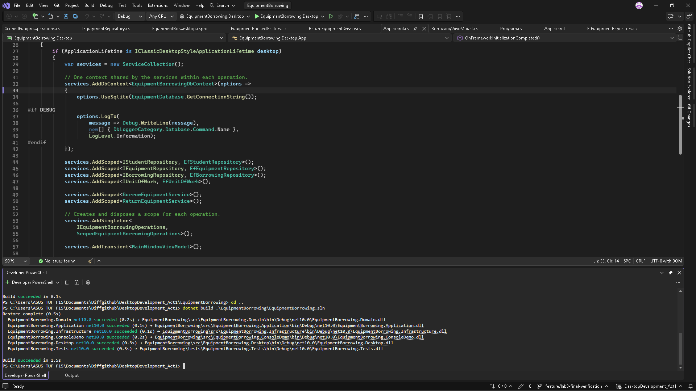
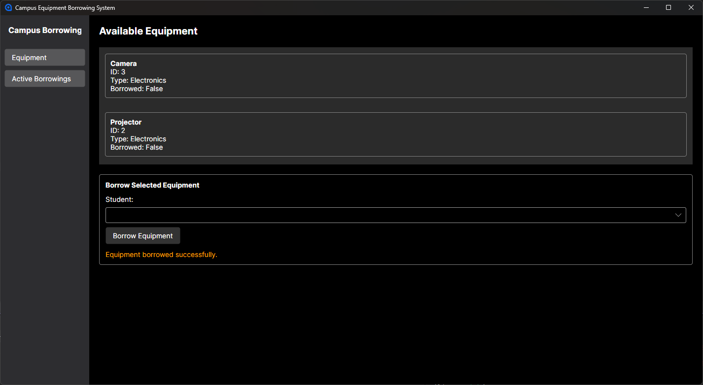

# Persistence Verification

## Applied Migrations

The application database records InitialCreate and SeedInitialData
as applied using EF Core 10.0.12.

## Stored Borrowing History

Before returning the Camera, the database contained four returned
Laptop loans with return timestamps and one active Camera loan
with ReturnedAt set to NULL.

## Borrowing Survives Restart

After closing and reopening the application, John Doe's Camera
loan remained visible in Active Borrowings.

## Return Survives Restart

The Camera was returned successfully.

After another application restart, Active Borrowings was empty.

Camera appeared in Available Equipment with Borrowed: False.

## Database Tables

The SQLite viewer shows Students, Equipment, Borrowings,
and the EF Core migration tables.

## Stored Students

The database contains three seeded students. John Doe and Alice Johnson
are authorized to borrow; Jane Smith is not.

## Successful Build

The complete solution built successfully using:

dotnet build .\EquipmentBorrowing\EquipmentBorrowing.sln

## Successful Borrowing

The application confirmed that equipment was borrowed successfully.

